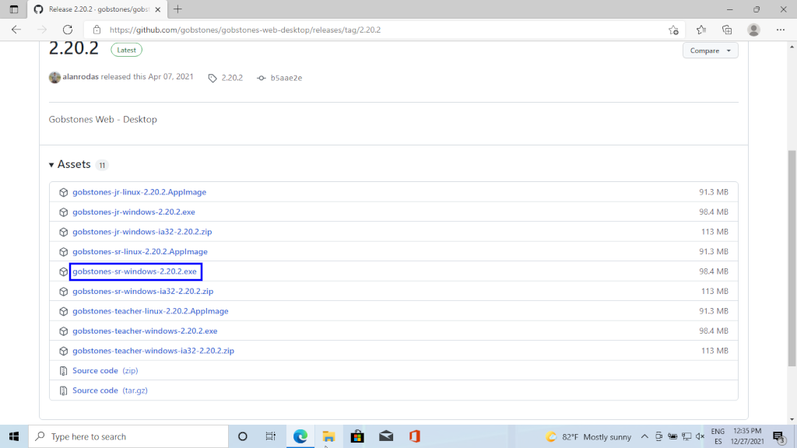

[volver](index.md) 
## gobstones

### instalación de gobstones

1. En su browser preferido ingresar al <a href="https://gobstones.github.io" target="_blank">sitio</a> y hacer clik en: *Versiones Desktop* 
  
2. Hacer clik en la versión deseada según el sistema operativo, seguiremos el caso particular de Windows 64 bit 
  
3. Una vez finalizada la descarga ejecutamos el archivo *gobsotnes-sr-windows-2.20.2.exe*  
4. Seleccionar la carpeta donde se desea instalar Gobstones  
5. Esperar que se complete el proceso de instalación y luego hacer clik en: *Finish*  

&nbsp;

