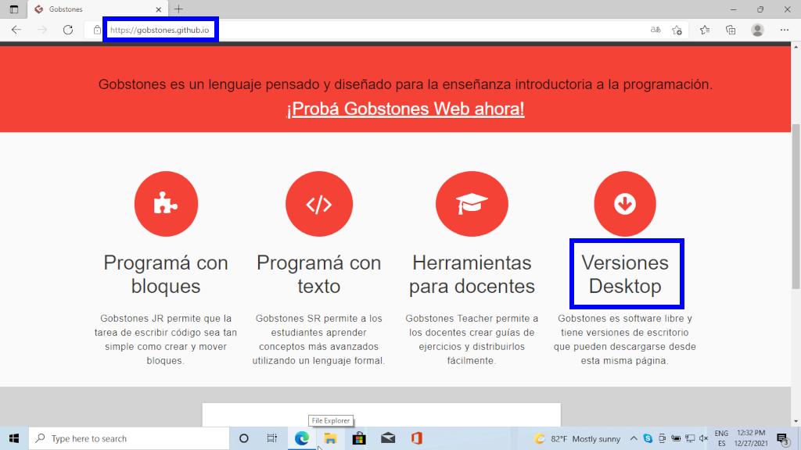

[volver](index.md) 
## gobstones

### instalación de gobstones

1. En su browser preferido ingresar al [sitio](https://gobstones.github.io) y hacer clik en: *Versiones Desktop*

2. Contratos y Procedimientos <a href="material/teoria/2-ContratosYProcedimientos.pptx" target="_blank">descargar</a>

&nbsp;

